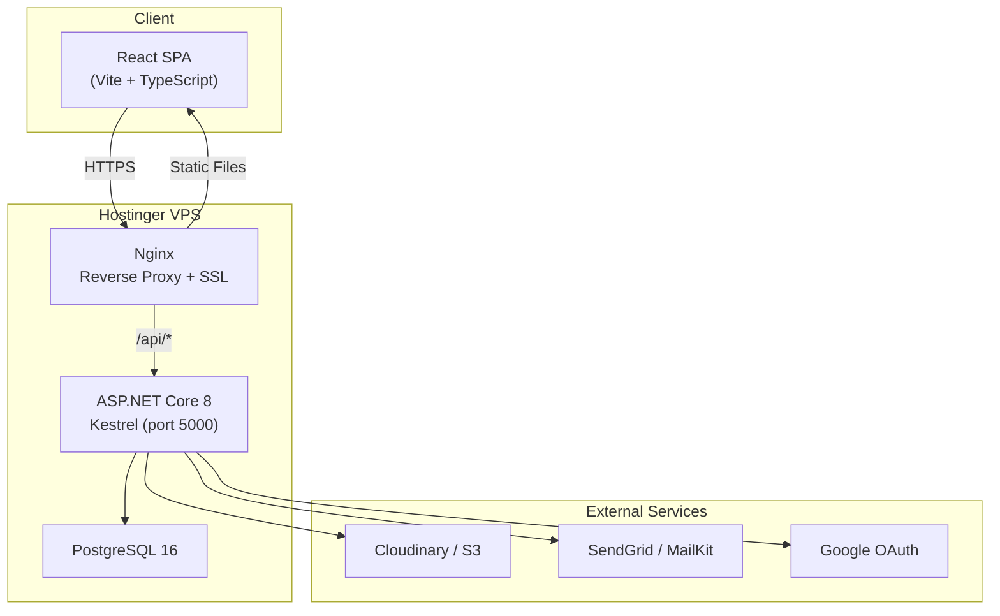
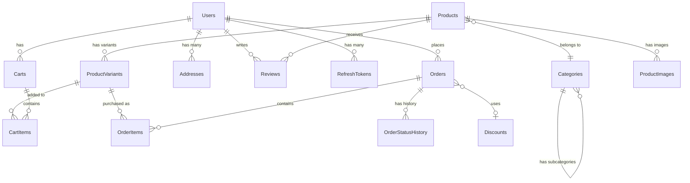
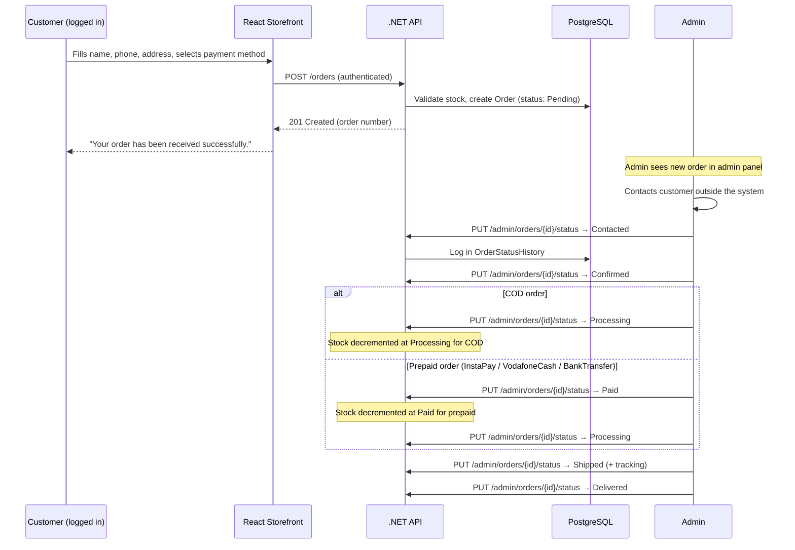
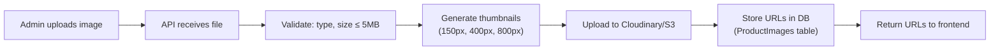
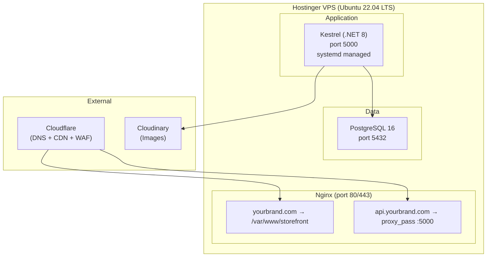
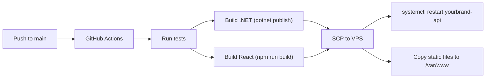

# E-Commerce Platform — Architecture Plan

## Overview

A decoupled e-commerce platform: **React SPA** (storefront + admin) talking to an **ASP.NET Core 8 Web API** over REST, deployed on a **Hostinger VPS** with PostgreSQL. Orders are confirmed manually — no payment gateways, no automated messaging. The admin reviews orders and contacts customers outside the system.

**Key decisions:**
- **No guest checkout** — account required before ordering
- **Bilingual** — English (LTR) + Arabic (RTL) from day one
- **Single admin** — one person manages everything, role system extensible for future growth
- **Payment-dependent workflow** — COD orders skip "Paid" status, prepaid orders require it

---

## Architecture Diagram



---

## Backend (.NET 8) Structure

### Project Layout

```
/src
  /YourBrand.API              → Controllers, middleware, filters, startup
  /YourBrand.Application       → Services, DTOs, validators, interfaces
  /YourBrand.Domain            → Entities, value objects, enums, domain events
  /YourBrand.Infrastructure    → EF Core, repositories, external service clients
  /YourBrand.SharedKernel      → Cross-cutting: Result<T>, pagination, exceptions
/tests
  /YourBrand.UnitTests         → Domain + service logic tests
  /YourBrand.IntegrationTests  → API endpoint tests with WebApplicationFactory
```

### SharedKernel Project

- **`Result<T>`** pattern — return structured error responses instead of throwing exceptions for expected failures (out of stock, invalid coupon).
- **Pagination wrapper** (`PagedResult<T>`) — consistent paging across all list endpoints.
- **Guard clauses** — reusable input validation helpers.

### API Layer

| Concern | Approach |
|---|---|
| Validation | FluentValidation on all request DTOs |
| Error handling | Global exception middleware returning RFC 7807 Problem Details |
| Rate limiting | ASP.NET Core 8 built-in rate limiter on auth endpoints |
| API versioning | URL-based versioning (`/api/v1/`) from day one |
| Response compression | Brotli + Gzip via middleware |
| Health checks | `/health` endpoint checking DB connectivity |
| Localization | `Accept-Language` header determines response language for error messages and validation |

### Service Layer Patterns

- **MediatR for CQRS-lite**: Separate command handlers (writes) from query handlers (reads).
- **Idempotency on order creation**: Accept an `Idempotency-Key` header on `POST /orders` to prevent duplicate orders from double-clicks on slow connections.

---

## Database Design

### Why PostgreSQL

- **JSONB columns**: Used for translatable fields (name, description in EN/AR) and flexible product metadata.
- **Full-text search**: Built-in `tsvector` for product search without needing Elasticsearch.
- **Better concurrency**: MVCC handles concurrent stock updates gracefully.
- **Array types**: Useful for tags, image URL lists.
- **EF Core support**: Npgsql provider is mature and well-maintained.

### Entity Relationship Diagram



### Translatable Fields Pattern

Products, categories, and SEO fields use **JSONB columns** for translations instead of separate translation tables. This keeps queries simple and avoids complex joins:

```json
// Product.Name column (JSONB)
{
  "en": "Classic Cotton T-Shirt",
  "ar": "تيشيرت قطن كلاسيكي"
}

// Product.Description column (JSONB)
{
  "en": "Soft, breathable cotton t-shirt for everyday wear.",
  "ar": "تيشيرت قطني ناعم ومسامي للارتداء اليومي."
}
```

The API accepts an `Accept-Language` header (`en` or `ar`) and returns the appropriate translation. Admin endpoints return all translations for editing.

> [!TIP]
> **Why JSONB over a Translations table?** For a two-language store, JSONB is simpler — no joins, no N+1 queries, easier to manage in the admin panel. A separate translations table makes more sense at 5+ languages. JSONB is easily migrated to a table later if needed.

### Entity Details

#### Products
```
Products
├── Id (GUID)
├── Slug (URL-friendly, unique, indexed — language-neutral)
├── Name (JSONB: {"en": "...", "ar": "..."})
├── Description (JSONB: {"en": "...", "ar": "..."})
├── BasePrice, CompareAtPrice
├── CategoryId (FK)
├── Metadata (JSONB — flexible key-value for specs)
├── Tags (text[])
├── Status (enum: Draft / Active / Archived)
├── SeoTitle (JSONB: {"en": "...", "ar": "..."})
├── SeoDescription (JSONB: {"en": "...", "ar": "..."})
├── CreatedAt, UpdatedAt
├── IsDeleted (soft delete)
```

#### Categories
```
Categories
├── Id (GUID)
├── Slug (unique, indexed)
├── Name (JSONB: {"en": "...", "ar": "..."})
├── Description (JSONB: {"en": "...", "ar": "..."})
├── ParentCategoryId (FK, nullable — for subcategories)
├── SortOrder
├── IsActive
```

#### ProductVariants
```
ProductVariants
├── Id (GUID)
├── ProductId (FK)
├── SKU (unique, indexed)
├── Size, Color (nullable)
├── PriceOverride (nullable — falls back to Product.BasePrice)
├── StockQuantity
├── LowStockThreshold (per-variant, default 5)
├── Weight (for shipping calculation)
├── IsActive
```

> [!TIP]
> **Soft deletes on Products**: Never hard-delete a product that has been ordered. Use `IsDeleted` flag and filter it out in storefront queries, but keep it visible in admin and order history.

#### Orders
```
Orders
├── Id (GUID)
├── OrderNumber (human-readable, sequential: "ORD-2026-00001")
├── CustomerId (FK → Users, required — no guest checkout)
├── CustomerName (required)
├── CustomerPhone (required)
├── ShippingAddressSnapshot (JSONB)
├── Status (enum: Pending / Contacted / Confirmed / Paid / Processing / Shipped / Delivered / Cancelled)
├── PaymentMethod (enum: CashOnDelivery / InstaPay / VodafoneCash / BankTransfer)
├── SubTotal, DiscountAmount, ShippingCost, TotalAmount
├── DiscountId (FK, nullable)
├── CurrencyCode ("EGP")
├── TrackingNumber (nullable)
├── ShippingCarrier (nullable)
├── Notes (internal admin notes)
├── IdempotencyKey (unique, indexed)
├── CreatedAt, UpdatedAt
```

> [!IMPORTANT]
> **CustomerId is always required.** Every order is linked to a registered user account. No anonymous or guest orders.

> [!IMPORTANT]
> **Address snapshots, not FKs**: Store the full address as JSONB at order creation time. If the customer edits their address later, historical orders still show the original shipping destination.

#### OrderStatusHistory
```
OrderStatusHistory
├── Id (GUID)
├── OrderId (FK)
├── OldStatus
├── NewStatus
├── ChangedByUserId (FK → Users)
├── Notes (optional reason for status change)
├── CreatedAt
```

Every status change is logged automatically — who changed it, when, from what to what, and why.

#### AuditLog
```
AuditLogs
├── Id, EntityType, EntityId
├── Action (Created / Updated / Deleted)
├── ChangedBy (UserId)
├── OldValues (JSONB), NewValues (JSONB)
├── Timestamp
```

### Indexing Strategy

| Index | Table | Purpose |
|---|---|---|
| `IX_Products_Slug` (unique) | Products | Fast product page lookup |
| `IX_Products_CategoryId_Status` | Products | Category page filtering |
| `IX_Products_FullText` (GIN) | Products | Product search |
| `IX_ProductVariants_SKU` (unique) | ProductVariants | SKU lookup |
| `IX_ProductVariants_ProductId` | ProductVariants | Variant loading |
| `IX_Orders_CustomerId_CreatedAt` | Orders | Customer order history |
| `IX_Orders_Status` | Orders | Admin order filtering |
| `IX_Orders_IdempotencyKey` (unique) | Orders | Idempotent order creation |
| `IX_OrderStatusHistory_OrderId` | OrderStatusHistory | Status history lookup |
| `IX_CartItems_CartId` | CartItems | Cart loading |

---

## Authentication & Roles

### Account Requirement

All customers must register and log in before placing an order. The cart is always tied to an authenticated user — no guest sessions.

### Role Architecture

Currently **one role** is active; the system is built to support more roles in the future without code changes:

| Role | Current Use | Access |
|---|---|---|
| **Customer** | Active | Storefront, own orders, own profile, own cart |
| **Admin** | Active (1 person) | Full admin panel: products, categories, discounts, orders, settings, users |
| **Moderator** | Reserved for future | Orders only (view, update status, confirm payment, update shipping) |

The `[Authorize(Roles = "Admin")]` attribute is used throughout. When moderators are needed in the future, add the role and update the attribute to `[Authorize(Roles = "Admin,Moderator")]` on order endpoints only.

### Token Strategy

| Aspect | Approach |
|---|---|
| Auth mechanism | JWT access token (15 min) + HTTP-only refresh token (7 days) |
| Token storage (client) | Access token in memory (not localStorage), refresh token as HTTP-only secure cookie |
| Token refresh | Silent refresh via `/auth/refresh` before access token expires |
| Logout | Refresh token rotation — each refresh invalidates the old token |
| Password reset | Time-limited token via email, single-use |

> [!CAUTION]
> **Never store JWTs in localStorage.** It's accessible to any XSS attack. Store the access token in a JavaScript variable (in-memory) and the refresh token as an HTTP-only, Secure, SameSite=Strict cookie.

### Security Measures

- **CORS**: Lock to your exact frontend domain(s). No wildcards in production.
- **CSP headers**: Content Security Policy to prevent XSS — whitelist your CDN, font providers.
- **Brute force protection**: Rate limit login to 5 attempts per IP per 15 minutes. Lock account after 10 failed attempts with email notification.
- **Input sanitization**: HTML-encode all user-generated content (reviews, names) on output. Parameterized queries via EF Core.
- **Dependency scanning**: Run `dotnet list package --vulnerable` in CI.
- **HTTPS everywhere**: Redirect all HTTP to HTTPS at the Nginx level. Set HSTS header.

---

## Order Processing Flow

### What the Customer Sees

1. Must be **logged in** (redirect to login/register if not)
2. Browse products → Add to cart
3. Checkout:
   - Full Name (pre-filled from profile)
   - Phone Number (required)
   - Shipping Address
4. Select payment method: Cash on Delivery / InstaPay / Vodafone Cash / Bank Transfer
5. Submit order → Redirect to Order Confirmation page:

> *"Your order has been received successfully. Our team will review it and contact you shortly."*

6. Track order status on "My Orders" page

### Full Order Lifecycle



### Order Status Workflow — Payment Method Dependent

#### Cash on Delivery (COD)

"Paid" is skipped — the customer pays upon delivery:

```
Pending → Contacted → Confirmed → Processing → Shipped → Delivered
```

Stock is decremented at **Processing** (the order is committed at this point).

#### InstaPay / Vodafone Cash / Bank Transfer (Prepaid)

"Paid" is required — admin confirms payment was received before processing:

```
Pending → Contacted → Confirmed → Paid → Processing → Shipped → Delivered
```

Stock is decremented at **Paid** (payment is verified).

#### Cancellation

An order can be cancelled at any point before Shipped. If stock was already decremented, it is restored.

### Status Transition Rules

The API enforces different valid transitions based on `PaymentMethod`:

**COD orders:**
```
Pending     → Contacted, Cancelled
Contacted   → Confirmed, Cancelled
Confirmed   → Processing, Cancelled
Processing  → Shipped, Cancelled (stock restored)
Shipped     → Delivered
Delivered   → (terminal)
Cancelled   → (terminal)
```

**Prepaid orders (InstaPay / VodafoneCash / BankTransfer):**
```
Pending     → Contacted, Cancelled
Contacted   → Confirmed, Cancelled
Confirmed   → Paid, Cancelled
Paid        → Processing, Cancelled (stock restored)
Processing  → Shipped, Cancelled (stock restored)
Shipped     → Delivered
Delivered   → (terminal)
Cancelled   → (terminal)
```

> [!IMPORTANT]
> **Stock decrement timing differs by payment method.** For COD, stock decrements at "Processing" (order committed for shipment). For prepaid, stock decrements at "Paid" (payment verified). On cancellation after decrement, stock is always restored.

### Status Details

| Status | What it means | Stock impact |
|---|---|---|
| **Pending** | Customer placed order. Waiting for admin review. | No change |
| **Contacted** | Admin has reached out to the customer outside the system. | No change |
| **Confirmed** | Customer confirmed they want the order. | No change |
| **Paid** | *(Prepaid only)* Admin verified payment was received. | **Decremented** |
| **Processing** | Order is being prepared/packed. | **Decremented** (COD only — already decremented for prepaid) |
| **Shipped** | Order dispatched. Tracking number added. | No change |
| **Delivered** | Order completed. | No change |
| **Cancelled** | Order cancelled. | **Restored** if previously decremented |

### Background Jobs

Use **Hangfire** with PostgreSQL storage:

| Job | Schedule | Purpose |
|---|---|---|
| Low stock notifications | Every hour | Email admin when variants drop below threshold |
| Stale order alerts | Every 4 hours | Flag orders stuck in "Pending" for > 24 hours |
| Database backup | Daily | pg_dump to off-VPS storage |

---

## Admin Panel

### Route Structure

Since there is one admin and no moderators, all routes require `Admin` role:

```
/admin                    → Dashboard
/admin/orders             → Order list (filter, search, sort)
/admin/orders/:id         → Order detail + status management
/admin/products           → Product list
/admin/products/new       → Create product (bilingual fields)
/admin/products/:id/edit  → Edit product
/admin/categories         → Category management (bilingual)
/admin/customers          → Customer list
/admin/discounts          → Coupon management
/admin/reviews            → Review moderation
/admin/settings           → Store settings (shipping rates, default language, etc.)
```

### Order Detail Page

```
┌─────────────────────────────────────────────────────┐
│  ORDER #ORD-2026-00042               [Status Badge] │
│  Payment Method: Cash on Delivery                   │
├─────────────────────────────────────────────────────┤
│                                                     │
│  ┌─────────────────┐  ┌──────────────────────────┐  │
│  │ Customer Info    │  │ Ordered Items            │  │
│  │                  │  │                          │  │
│  │ Name: Ahmed M.   │  │ Product A (M, Black) x2 │  │
│  │ Phone: 01X-XXX   │  │ Product B (L, White) x1 │  │
│  │ Address: ...     │  │                          │  │
│  │ Account: ✓       │  │ Subtotal:    450 EGP     │  │
│  │                  │  │ Shipping:     50 EGP     │  │
│  │                  │  │ Discount:    -50 EGP     │  │
│  │                  │  │ Total:       450 EGP     │  │
│  └─────────────────┘  └──────────────────────────┘  │
│                                                     │
│  ┌──────────────────────────────────────────────┐   │
│  │ Status Timeline                               │   │
│  │                                                │   │
│  │ ● Pending    → ● Contacted → ○ Confirmed      │   │
│  │   Jun 11       Jun 11                          │   │
│  │   09:30        10:15                           │   │
│  │                Note: "Called, will pay COD"     │   │
│  │                                                │   │
│  │ [ Update Status ▼ ]  (shows only valid next)   │   │
│  │                                                │   │
│  │ Note: COD order — "Paid" step is skipped       │   │
│  └──────────────────────────────────────────────┘   │
│                                                     │
│  ┌──────────────────────────────────────────────┐   │
│  │ Internal Notes                                │   │
│  │                                                │   │
│  │ "Customer prefers morning delivery"            │   │
│  │ — Admin, Jun 11 10:15                          │   │
│  │                                                │   │
│  │ [ Add note... ]                                │   │
│  └──────────────────────────────────────────────┘   │
└─────────────────────────────────────────────────────┘
```

The **"Update Status" dropdown shows only valid next statuses** based on the payment method and current status. For a COD order in "Confirmed" status, it shows "Processing" and "Cancelled" (not "Paid").

### Product Management — Bilingual

The product create/edit form has **side-by-side or tabbed language fields**:

```
┌─────────────────────────────────────────────────┐
│  Create Product                                  │
├─────────────────────────────────────────────────┤
│                                                  │
│  [English] [العربية]                             │
│                                                  │
│  Name (EN): Classic Cotton T-Shirt               │
│  Name (AR): تيشيرت قطن كلاسيكي                  │
│                                                  │
│  Description (EN): Soft, breathable cotton...     │
│  Description (AR): تيشيرت قطني ناعم ومسامي...    │
│                                                  │
│  SEO Title (EN): _______________                  │
│  SEO Title (AR): _______________                  │
│                                                  │
│  --- Non-translatable fields ---                  │
│  Price: ____  Compare At: ____                    │
│  Category: [dropdown]                             │
│  Status: [Draft / Active / Archived]              │
│                                                  │
└─────────────────────────────────────────────────┘
```

### Dashboard

- **Pending orders** (count + time since oldest) — **top of dashboard, prominent**
- Orders by status (pie chart)
- Revenue today / this week / this month
- Top-selling products (last 30 days)
- Low stock alerts
- Recent orders feed

### Image Upload Pipeline



---

## Frontend (React) — Structure & Localization

### Tech Stack

| Concern | Choice | Rationale |
|---|---|---|
| Build tool | **Vite 6** | Fast HMR, ESBuild-powered |
| Language | **TypeScript** (strict mode) | Mirrors .NET DTOs, catches bugs at compile time |
| Routing | **React Router v7** | Nested layouts, language-prefixed routes |
| Server state | **TanStack Query v5** | Caching, background refetching |
| Client state | **Zustand** | Lightweight — for cart, auth, UI state, selected language |
| Forms | **React Hook Form + Zod** | Schema validation matching backend DTOs |
| Animations | **Framer Motion** | Best-in-class React animation library |
| Styling | **CSS Modules** or **Vanilla CSS** | No runtime cost, scoped styles |
| HTTP client | **Axios** with interceptors | Auto-attach JWT + `Accept-Language` header |
| Icons | **Lucide React** | Consistent, lightweight icon set |
| **i18n** | **react-i18next** | Industry standard for React localization |

### Project Structure

```
/src
  /api           → Axios instance (sends Accept-Language header), API client functions
  /components    → Reusable UI components (Button, Card, Modal, etc.)
  /features
    /products    → ProductList, ProductDetail, ProductCard
    /cart        → CartDrawer, CartItem, CartSummary
    /checkout    → CheckoutForm, ShippingStep, PaymentMethodStep, OrderConfirmation
    /auth        → LoginForm, RegisterForm, ForgotPassword
    /orders      → OrderHistory, OrderDetail, OrderTracking
    /admin       → AdminLayout, Dashboard, ProductManager, OrderManager
  /hooks         → useAuth, useCart, useDebounce, useMediaQuery, useLanguage
  /i18n
    /locales
      /en.json   → English translations (UI strings)
      /ar.json   → Arabic translations (UI strings)
    i18n.ts      → react-i18next configuration
  /layouts       → StoreLayout, AdminLayout, AuthLayout
  /stores        → Zustand stores (authStore, cartStore, uiStore, languageStore)
  /types         → TypeScript interfaces mirroring backend DTOs
  /utils         → formatCurrency, dateHelpers, validators
  /styles        → Global CSS, variables, design tokens
```

### Localization Architecture

#### Language-Aware URLs

```
yourbrand.com/en/products/classic-cotton-tshirt
yourbrand.com/ar/products/classic-cotton-tshirt
```

The language prefix (`/en/`, `/ar/`) is handled by React Router as a top-level route parameter. The slug remains the same in both languages (language-neutral slugs).

#### What Gets Translated Where

| Content | Where translated | How |
|---|---|---|
| UI strings (buttons, labels, messages) | Frontend | `react-i18next` with JSON locale files (`en.json`, `ar.json`) |
| Product name, description, SEO | Database | JSONB field, API returns correct language based on `Accept-Language` header |
| Category names, descriptions | Database | JSONB field, same as products |
| Error messages, validation | Backend | ASP.NET Core localization with resource files |
| Dates, numbers, currency | Frontend | `Intl.DateTimeFormat`, `Intl.NumberFormat` with correct locale |

#### RTL Support

CSS uses **logical properties** instead of directional ones:

```css
/* ✗ Breaks in RTL */
.card { margin-left: 16px; padding-right: 8px; text-align: left; }

/* ✓ Works in both LTR and RTL */
.card { margin-inline-start: 16px; padding-inline-end: 8px; text-align: start; }
```

The `<html>` element gets `dir="rtl" lang="ar"` or `dir="ltr" lang="en"` based on the selected language. The language switcher updates this attribute, the Zustand store, and the URL prefix simultaneously.

#### Language Switcher Component

A simple toggle in the header/navbar:

```
[EN | ع]
```

On switch:
1. Update `languageStore` (Zustand)
2. Update `<html dir="..." lang="...">`
3. Update URL prefix (`/en/` ↔ `/ar/`)
4. Update `Accept-Language` header on Axios instance
5. Invalidate TanStack Query cache (product data needs refetch in new language)

#### Axios Interceptor

Every API request includes the current language:

```typescript
axios.interceptors.request.use((config) => {
  config.headers['Accept-Language'] = languageStore.getState().language; // "en" or "ar"
  return config;
});
```

### Performance Optimizations

- **Route-based code splitting**: `React.lazy()` + `Suspense` for admin routes.
- **Image lazy loading**: `loading="lazy"` on product images.
- **Optimistic cart updates**: Update UI immediately on add-to-cart, reconcile with server response.
- **Prefetching**: Prefetch product detail data on hover over product cards.
- **Service Worker**: Cache static assets for repeat visits (Workbox via Vite PWA plugin).

### SEO Considerations

| Aspect | Implementation |
|---|---|
| Prerendering | `vite-plugin-prerender` for product and category pages |
| hreflang tags | `<link rel="alternate" hreflang="en" href="/en/..." />` and `<link rel="alternate" hreflang="ar" href="/ar/..." />` on every page |
| Canonical URLs | Each language version is canonical for its language |
| Meta tags | Translated `<title>` and `<meta description>` from database JSONB fields |
| Semantic HTML | Proper `lang` and `dir` attributes on `<html>` |

---

## Deployment on Hostinger VPS

### VPS Specification

Start with **KVM 2** (2 vCPU, 8 GB RAM, 100 GB NVMe) — roughly $12-15/month:
- Nginx
- .NET 8 runtime (Kestrel)
- PostgreSQL 16

### Server Architecture



### Cloudflare Layer (Free Tier)

- **CDN**: Caches static frontend assets at edge.
- **WAF**: Basic protection against common attacks.
- **DDoS protection**: Included free.
- **SSL**: Free universal SSL certificate.
- **Analytics**: Basic traffic analytics.

### Deployment Pipeline



### Operational Essentials

| Concern | Solution |
|---|---|
| **Logging** | Serilog → structured JSON logs → file (rotate daily, keep 30 days) |
| **Monitoring** | Uptime Robot (free) pinging `/health` every 5 min |
| **Backups** | Daily `pg_dump` → compressed → upload to S3/Google Drive. Keep 14 days. |
| **SSL** | Cloudflare handles it |
| **Firewall** | UFW: allow 80, 443, 22 (SSH with key-only auth) |
| **Updates** | `unattended-upgrades` for security patches |

---

## Phased Build Order

### Phase 1: Foundation (Week 1-2)

- [ ] Set up .NET 8 solution with layered project structure
- [ ] Configure PostgreSQL + EF Core with Npgsql
- [ ] Set up ASP.NET Core localization (resource files for EN/AR error messages)
- [ ] Implement entities with JSONB translatable fields: Product, ProductVariant, Category, ProductImage
- [ ] Build `ProductsController` and `CategoriesController` (CRUD, `Accept-Language` aware)
- [ ] Add global error handling middleware (Problem Details, localized)
- [ ] Add request validation with FluentValidation
- [ ] Seed database with test products (EN + AR translations)
- [ ] Write integration tests for product endpoints (both languages)

**🚪 Gate**: Products API returns correct language based on `Accept-Language` header. CRUD works. All tests pass.

---

### Phase 2: Auth & Users (Week 2-3)

- [ ] Set up ASP.NET Core Identity with PostgreSQL
- [ ] Implement JWT access tokens + refresh token rotation
- [ ] Build `AuthController` (register, login, refresh, logout, forgot-password)
- [ ] Set up role-based authorization (Customer, Admin — Moderator reserved)
- [ ] Configure CORS for frontend domain
- [ ] Add rate limiting on auth endpoints
- [ ] Write auth integration tests

**🚪 Gate**: Can register, login, refresh tokens. Admin role has full access. Customer role limited to own data.

---

### Phase 3: Cart & Orders (Week 3-4)

- [ ] Implement Cart + CartItem entities (always tied to authenticated user, no guest sessions)
- [ ] Build `CartController` (add, update quantity, remove, get cart — requires auth)
- [ ] Implement Discount/Coupon entity and validation logic
- [ ] Build `OrdersController`:
  - [ ] `POST /orders` — create order (requires auth; name, phone, address, payment method)
  - [ ] `GET /orders` — customer's own order history
  - [ ] `GET /orders/:id` — order detail with status history
- [ ] Implement OrderStatusHistory — auto-log on every status change
- [ ] Implement **payment-method-dependent status transitions**:
  - [ ] COD: Pending → Contacted → Confirmed → Processing → Shipped → Delivered
  - [ ] Prepaid: Pending → Contacted → Confirmed → Paid → Processing → Shipped → Delivered
- [ ] Implement stock decrement (at "Paid" for prepaid, at "Processing" for COD)
- [ ] Implement stock restore on cancellation
- [ ] Build admin order endpoints:
  - [ ] `GET /admin/orders` — all orders with filters
  - [ ] `PUT /admin/orders/:id/status` — update status (validates transition based on payment method)
  - [ ] `PUT /admin/orders/:id/notes` — add internal notes
- [ ] Implement idempotent order creation
- [ ] Write order flow integration tests (COD flow AND prepaid flow separately)

**🚪 Gate**: COD order can skip "Paid". Prepaid order requires "Paid". Invalid transitions return 400. Stock decrements/restores at correct points. All orders linked to authenticated users.

---

### Phase 4: React Storefront (Week 4-6)

- [ ] Scaffold Vite + React + TypeScript project
- [ ] Set up `react-i18next` with `en.json` and `ar.json` locale files
- [ ] Set up CSS with logical properties for RTL support
- [ ] Implement language switcher (EN/AR toggle in header)
- [ ] Set up language-prefixed routes (`/en/...`, `/ar/...`)
- [ ] Set up design system (CSS variables, typography for both Latin and Arabic scripts)
- [ ] Build layout: header (with language switcher), navigation, footer, mobile responsive
- [ ] Product listing page with category filtering, search, pagination
- [ ] Product detail page with variant selection, image gallery
- [ ] Cart drawer/page with quantity controls (requires login)
- [ ] Auth pages (login, register, forgot password)
- [ ] Checkout flow (requires login):
  - [ ] Shipping step: Full Name, Phone Number, Address
  - [ ] Payment method step: COD / InstaPay / Vodafone Cash / Bank Transfer
  - [ ] Order review step
- [ ] Order Confirmation page: *"Your order has been received successfully. Our team will review it and contact you shortly."* (translated)
- [ ] Order history page with status timeline
- [ ] Set up Axios interceptors: JWT + refresh flow + `Accept-Language` header
- [ ] Set up TanStack Query for all API calls
- [ ] Add hreflang tags and translated meta tags for SEO

**🚪 Gate**: Full site works in both English (LTR) and Arabic (RTL). Language switcher works. Checkout requires login. Order confirmation shows correct translated message. Responsive on mobile.

---

### Phase 5: Admin Panel (Week 6-8)

- [ ] Admin layout with sidebar navigation
- [ ] **Order management:**
  - [ ] Order list with status filters, search, date range
  - [ ] Order detail page with:
    - [ ] Customer info (name, phone, address, payment method)
    - [ ] Ordered items with totals
    - [ ] Status timeline with full history
    - [ ] "Update Status" dropdown — **shows only valid next statuses based on payment method**
    - [ ] Visual indicator when order is COD (no "Paid" step)
    - [ ] Internal notes section
- [ ] Dashboard:
  - [ ] Pending orders alert (top of page)
  - [ ] Revenue summary
  - [ ] Orders by status
  - [ ] Top products
  - [ ] Low stock alerts
- [ ] **Product manager with bilingual fields:**
  - [ ] Side-by-side or tabbed EN/AR input for name, description, SEO
  - [ ] Image upload to Cloudinary
  - [ ] Variant management
- [ ] **Category manager with bilingual fields**
- [ ] Customer list with order history
- [ ] Discount code manager
- [ ] Review moderation
- [ ] Store settings (shipping rates, default language)

**🚪 Gate**: Admin can manage bilingual products. Order status dropdown enforces correct transitions based on payment method. COD orders show no "Paid" option. Dashboard shows accurate data.

---

### Phase 6: Notifications & Polish (Week 8-9)

- [ ] Set up email service (SendGrid or MailKit via SMTP)
- [ ] Email templates (bilingual): order received, password reset
- [ ] Background jobs: stale order alerts, low stock notifications
- [ ] Polish UI: loading states, error states, empty states (all translated)
- [ ] Test full order flow end-to-end (COD flow + prepaid flow)
- [ ] Test both languages end-to-end

**🚪 Gate**: Emails send in customer's preferred language. Background jobs run. Both order flows work completely. Site polished in both EN and AR.

---

### Phase 7: Deployment & Go-Live (Week 9-10)

- [ ] Provision Hostinger VPS (Ubuntu 22.04)
- [ ] Install .NET 8 runtime, PostgreSQL 16, Nginx
- [ ] Configure Nginx: static files for frontend, reverse proxy for API
- [ ] Set up systemd service for .NET API
- [ ] Configure Cloudflare DNS + SSL
- [ ] Set up UFW firewall rules
- [ ] Deploy application via GitHub Actions
- [ ] Configure database backups (daily pg_dump)
- [ ] Set up Uptime Robot monitoring
- [ ] Run end-to-end test orders (both COD and prepaid flows)
- [ ] Test Arabic RTL layout on production
- [ ] Configure Serilog for production logging
- [ ] Load test with basic scenarios (50-100 concurrent users)

**🚪 Gate**: Site is live in both languages. Both order flows work. SSL works. Backups run. Monitoring active.

---

### Phase 8: Post-Launch (Week 10-11)

- [ ] Monitor error logs for first week, fix issues
- [ ] Add prerendering for SEO on product/category pages (both languages)
- [ ] Implement product review system
- [ ] Add "related products" recommendations (same category)
- [ ] Performance audit (Lighthouse score > 90)
- [ ] Security scan (OWASP ZAP or similar)
- [ ] Document deployment runbook

---

## Verification Plan

### Automated Tests
```bash
# Backend
dotnet test --filter Category=Unit
dotnet test --filter Category=Integration

# Frontend
npm run test          # Vitest unit tests
npm run test:e2e      # Playwright E2E tests

# Security
dotnet list package --vulnerable
npm audit
```

### Manual Verification — Order Flow (COD)
1. **Customer places COD order** → status = Pending, stock unchanged
2. **Admin → Contacted** → logged in history
3. **Admin → Confirmed** → logged in history
4. **Admin → Processing** → **stock decremented** (no "Paid" step)
5. **Admin → Shipped** (+ tracking) → tracking visible to customer
6. **Admin → Delivered** → order complete, no further changes
7. **Test: "Paid" is NOT available** as an option for COD orders

### Manual Verification — Order Flow (Prepaid)
1. **Customer places InstaPay order** → status = Pending, stock unchanged
2. **Admin → Contacted → Confirmed** → stock still unchanged
3. **Admin → Paid** → **stock decremented**
4. **Admin → Processing → Shipped → Delivered** → complete
5. **Test cancellation after Paid** → stock restored

### Manual Verification — Localization
- Switch to Arabic → entire storefront in RTL, Arabic text, Arabic product names
- Switch to English → back to LTR, English text, English product names
- Product in admin → bilingual fields (EN + AR) save and display correctly
- hreflang tags present in page source
- Currency displays correctly in both languages (EGP)
- Dates format correctly in both locales

### Manual Verification — Auth
- Cannot add to cart without login → redirect to login page
- Cannot access checkout without login
- Cannot access admin panel with Customer role
- All orders linked to user account

### Manual Verification — General
- Test on mobile devices (responsive layout, both LTR and RTL)
- Verify rate limiting blocks brute force login attempts
- Check backup restore works
- Verify Cloudflare caching works
